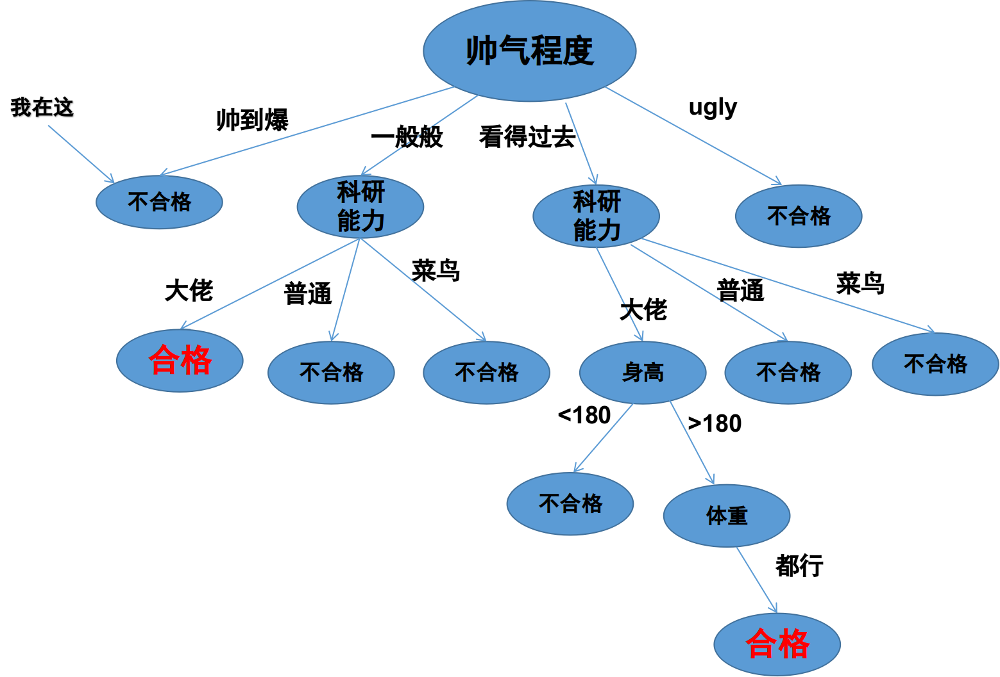
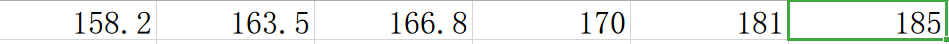
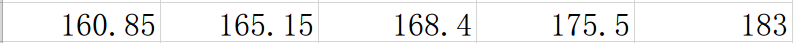
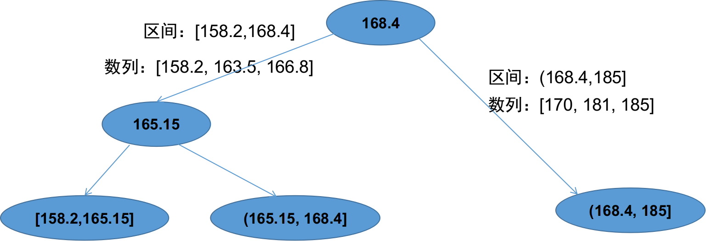
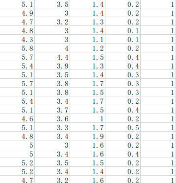

##写在前面
这是好久之前遗留的一篇博客，最近要好好谢谢文字，所以把之前落下的补上，欢迎大家批评指正。关于决策树的理论部分，我之前写过一篇博客，同时也实现了决策树的算法[离散型决策树的C++实现](https://blog.csdn.net/luoluonuoyasuolong/article/details/78696829)，但是当时的那个实现只能针对训练数据是离散型变量的，不能处理连续型数值。这篇文章是继承上面那一篇文章的，所有的理论部分全部都可以在上一篇文章中看到，这篇文章着重处理连续型变量怎样用决策树处理。所以在读这篇文章之前可以看一看前面那篇，兴许会对决策树本身的算法理解上有很大帮助。

## 举个简单的例子
首先我们要弄清楚，什么是离散型随机变量，什么是连续型随机变量。这个问题其实非常的简单，我们可以举个简单的例子，比如女孩子选择男朋友这件事，我们仅仅举一个简单的例子，这里不对这件事情本身做任何讨论，毕竟感情这比较复杂，而分类器比较简单。好，就拿女孩子选择男朋友这件事，假设每个女孩子在自己的心目中都由一棵选择男孩子的决策树，假设女孩子找男朋友只看中四个标准，1. 帅气程度，2.科研能力 3. 身高 4. 体重。在这个四个指标中，我们就可以看出第一项和第二项是明显的离散型变量，因为帅气程度一般我们就分为：帅到爆，一般般，看得过去，ugly。

而科研能力一般就分为：大神(可以科研带飞型)，普通(可以共同学习型)，菜鸟(隐藏的大神)。而第三和第四项是明显的连续型变量，身高大致取值是[150-220cm]这个区间的任意值都有可能，体重同样大概取值在[20-100kg]之间。所以决策树在解决离散型和连续型变量时是有很大差异的。原则上决策树并不能处理连续型数据，只能处理离散型数据，为什么呢？因为在决策树中某个属性有几个值就会有几条分支，而连续型变量有无穷多个取值，但决策树不可能有无穷多个分支，所以要想办法将连续型变量进行离散化，这是问题的关键。

我们可以看下面一个既有离散型变量，又有连续型变量的例子

上图是女孩A心中的一棵与找男朋友有关的决策树，首先女孩子比较看中帅气程度这个属性，然后比较看中科研能力，再然后是身高、体重。大家可以看到这个女孩子对于帅气程度的要求既不能太高也不能太低，所以我第一个就被pass了，为什么呢，这个我就不多解释了，都是泪，看图，这说明了，我们没有缘分。其次，该女孩可能是一位科研大佬，需要另一半也有很强的科研能力才可以。重点是身高和体重，我们看女孩A心中的决策树把身高划分为>180和<180两个离散变量，这就是连续变量离散化的最简单的一种方式。好了，我们要解决的问题就是上面所述那样，在用决策树处理分类问题时同时解决离散型变量和连续型变量。具体在理论上和实际中是怎么处理这样的问题的呢？下面，我们继续讨论。

## 理论部分
这个问题当时我调研了好久，发现很久很久以前就有人做过相关的工作了，我找到了最早的一篇是
[Compression-Based Discretization of Continuous Attributes](1995)，
但实际上我编程用的方法是

[二分法基于C4.5的机制](1993),

1996年也有一篇文章：

[Finding Optimal Multi-Splits for Numerical Attributes in Decision Tree Learning](1996)

还有一篇2003年的文章

[Numerical Attributes in Decision Tress:A Hierarchical Approach](2003)

其中各类树形算法比如XGBoost

[XGBoost: A Scalable Tree Boosting System](xgboost)

都使用了类似的连续属性离散化的方法。不同的方法详细内容可以参考论文，但其实背后的原理都比较类似，就是划分区间，只是不同的方法进行划分的方法不同，标准也不同。总之，最终的结果就是将连续的区间划分为多个区间，然后在某个小区间内的所有数值算是一个类别，还是上面的例子，把身高进行划分，按照某个女孩的标准她可能会将男生的身高分为：

当然了，不同的人划分方法是不同的，这就是不同离散算法之间的差异啦。

### 二分法
这篇文章只介绍最简单的一种方法：二分法，后面的编程部分也是实现了这种方法，虽然这个方法比较简单，但是比较好理解，最能说明问题，同时该方法也是著名的C4.5决策树采用的机制，这里的介绍同样是借用了周志华老师的那本西瓜书，有书的同学可以直接看书啦。

假设给定样本集D，这个样本集就是有很多男孩子的信息啦，和连续属性hight(身高)，假设hight在样本集D中出现了n个不同的取值，将这些值从小到大进行排序，记为$\{h^1,h^2,...h^n\}$。接下来就要在这个数列中找到一个划分t，这个划分将整个数列分为两部分，一部分是t左边的,记为$D^{-}_t$，一部分是t右边的，记为$D^+_t$。关键的问题是怎样取这个划分呢？这个就是二分法的核心：根据信息增益选取划分点。

首先将排好序的数列每两个数值算一个平均值，将该平均值作为一个划分
$$
T = \{t_i=\frac{h^i + h^{i+1}}{2}\mid 1 \leq i \leq n-1\}
$$

然后我们需要找到一个使得信息增益(下面的式子)最大的一个划分$t_j$。
$$
Gain(D, hight) = \max\limits_{t\in T}Gain(D, hight, t) \\
=\max\limits_{t\in T} Ent(D) - \sum\limits_{\lambda\in\{-,+\}}\frac{\mid D^{\lambda}_t\mid}{\mid D \mid}Ent(D^{\lambda}_t)
$$
这里Ent(D)表示数据集D下的信息熵，这个熵是根据数据集下的标签计算的，具体的计算过程可以参考周志华老师的书，也可以看后面代码部分，这样更容易理解。

原理就是这么简单，具体怎么计算呢？我们举个简单的例子，假设有6个男孩子的信息，身高经过排名后分别是

生成的5个划分是

这里我们省去计算的部分，假设最终计算出来以168.4为切割的信息增益最大，那么我们第一次切割产生的两个区间就是[158.2，168.4]和(168.4, 185]。但是这样也只是产生了两个离散取值，如果连续区间内的取值很多，两个离散取值不能满足我们的要求怎么办呢？不用担心，既然可以解决两个就可以解决多个，古文曾说：一生二，二生三，三生万物，大道至简。
我们生成了两部分区间后可以分别在某个区间内再进行二分，这样的操作可以一直进行下去，直到你满意为止。
下图是上面的例子生成的最终三个区间示意图，其实这个过程我们可以理解为二叉树的建立过程，所有的叶子节点都是最终的划分的区间。


## C++代码实现
开始实践部分，这才是真正遇到的挑战呢，因为在这个过程中我遇到了各种各样的问题，调试了很久的代码才把最终的demo跑通，当然这里面还有很多待完善的内容，后面有时间再慢慢完善吧，但是To be honest,写出来以后就再也没有用心看过它啦，哈哈，懒，太懒。

下面的图片是我在写代码过程的总的流程，大致分为3个步骤：
1. 离散化
2. 建立树结构
3. 减枝
4. 预测
哦，是4个步骤。


值得一提的是，机器学习问题第一个重要的问题是用什么结构存储矩阵，以前我写离散决策树的时候用的是OpenCV的Mat类存储矩阵，确实很方便，但是OpenCV安转起来很麻烦，所以这次我用了另外一个科学计算的C++库:Eign。据说tensorflow的底层计算都是借用这个库，并且这个库只有头文件，不需要安装就可以使用啦，可以说是既方便有高效将，所以这里我用到了Eigen处理矩阵的科学计算部分。

怎么跑通我的代码呢？
这个很简单啦，我的代码只有下面4个接口

```

CDTree(int deepestTree, int max_bin, float thresholdInfoGain);
int buildTree(const MatrixXf &trainX, const MatrixXi &trainY, const MatrixXf &validateX, const MatrixXi &validateY, string Algorithm);
int buildTree(const MatrixXf &trainX, const MatrixXi &trainY, string Algorithm);
MatrixXi predict(const MatrixXf &testX);
```
`CDTree()`是构造函数，需要输入一些参数
`buildTree()`是构建树的接口，有两个实现，其中一种是有验证集的构建，另一种是没有验证集的构建
`predict`是预测函数
不出意外的话，这个类的输入输出数据都是通过Eigen结构存储的，那数据是怎样读取到Eigen的结构当中的呢？为了方便，我还写了将csv数据读入到Eigen结构中的类

```
template<typename dataT, typename labelT>
class RFCSV
{
public:
    string csvFileName;
    RFCSV()
    {
        this->csvFileName = "";
    }
    RFCSV(string fileName)
    {
        this->csvFileName = fileName;
    }

    std::pair<dataT, labelT> getData(string fileName)
    {
        
        
    }
    std::pair<dataT, labelT> getData()
    {

    }

    template <class Type>
    Type stringToNum(const string& str)
    {
       
    }
 
};
```

为了节省空间，类的实现没有写出来，文章最后我将源代码放在git上，感兴趣的同学慢慢看。

最后，我们看一个完整的样例：

主函数是这样的
```
#include <iostream>
#include "CDTree.hpp"
#include "RFCSV.hpp"
#include <Eigen/Dense>
using Eigen::MatrixXf; using Eigen::MatrixXi;
int main()
{

	std::pair<MatrixXf, MatrixXi> trainData, testData;
	RFCSV<MatrixXf, MatrixXi> readcsv;
	trainData = readcsv.getData("../data/ContinuousTrain.csv");
	testData = readcsv.getData("../data/ContinuousTest.csv");
	CDTree myCDTree(4, 3, 0.0001);
	myCDTree.buildTree(trainData.first, trainData.second, "ID3");
	MatrixXi predictresult = myCDTree.predict(testData.first);
	float accuracy = 0;
	for (int i = 0; i < predictresult.size(); i++)
	{
		if (testData.second(i) == predictresult(i))
		{
			accuracy += 1.0 / predictresult.size();
		}
	}
	cout << "准确率为：" << accuracy * 100 << "\% 你很棒棒哦！" << endl;
}
```
数据样例是这样的

前面4列是连续属性，最后一列是标签。
最终的输出结果是：


总结：代码中用到了k-means聚类，合成最小区间数，但是这个操作使得算法稳定性极差，我觉得应该采用更加简单的方法解决这个问题，其实离散属性不宜划分的过多，过多的离散值会造成决策树过拟合，所以什么时候停止划分区间这个问题是亟待解决的。

最后，遇到了喜欢的女孩子，希望我能契合她心目中的那棵决策树，从树根到数叶，那不是机器学习的过程，是我们相互学习的过程，不契合也没有关系，能喜欢上你已经是万分荣幸啦！

掌管天堂的空之王者，于地狱唱响容光之歌！
